# Adding a Storage Layer
## **Creating a Static Website for the Café**
### **Scenario**

Frank and Martha are a husband-and-wife team who own and operate a small café business that sells desserts and coffee. Their daughter, Sofía, and their other employee, Nikhil—who is a secondary school student—also work at the café. The café has a single location in a large city.

The café currently doesn’t have a marketing strategy. They mostly gain new customers when someone walks by, notices the café, and decides to try it. The café has a reputation for high-quality desserts and coffees, but their reputation is limited to people who have visited, or who have heard about them from their customers.

Sofía suggests to Frank and Martha that they should expand community awareness of what the café has to offer. The café doesn’t have a web presence yet, and it doesn’t currently use any cloud computing services. However, that situation is about to change.


### **Launching a static website**

> **Creating an S3 bucket to host the static website**
- We must disable **Block all public access** and enable the **ACLs enabled** option.
- Enable static website hosting on your bucket


> **Uploading content to your S3 bucket**
- Upload the project website folders to the S3 bucket.
- We can use the endpoint link to access the static website

<div style="display: flex; width: 50%;">
    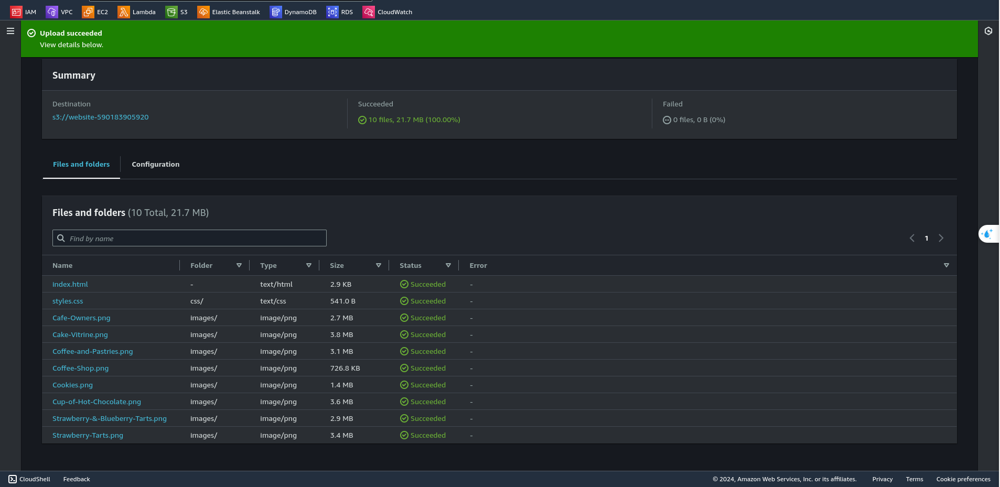
    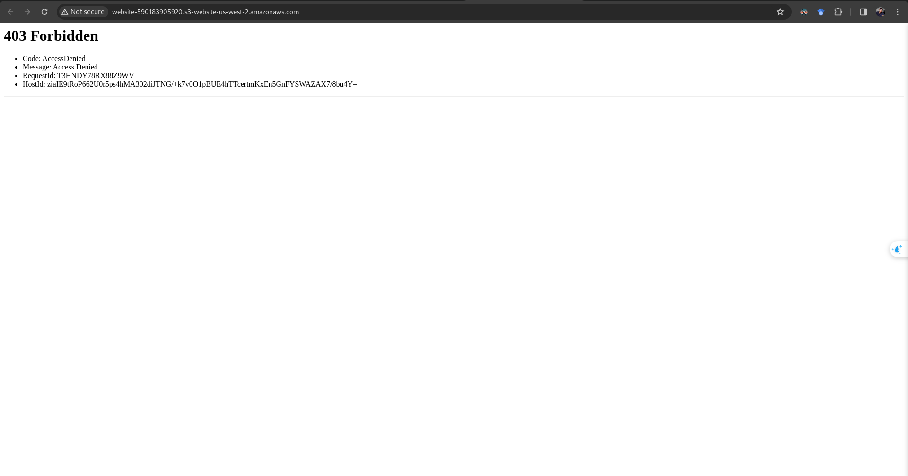
</div>

> **Creating a bucket policy to grant public read access**
- Create a bucket policy that grants read-only permission to public anonymous users by using the Bucket Policy editor
- the website for the café is now publicly accessible

<div style="display: flex; width: 50%;">
    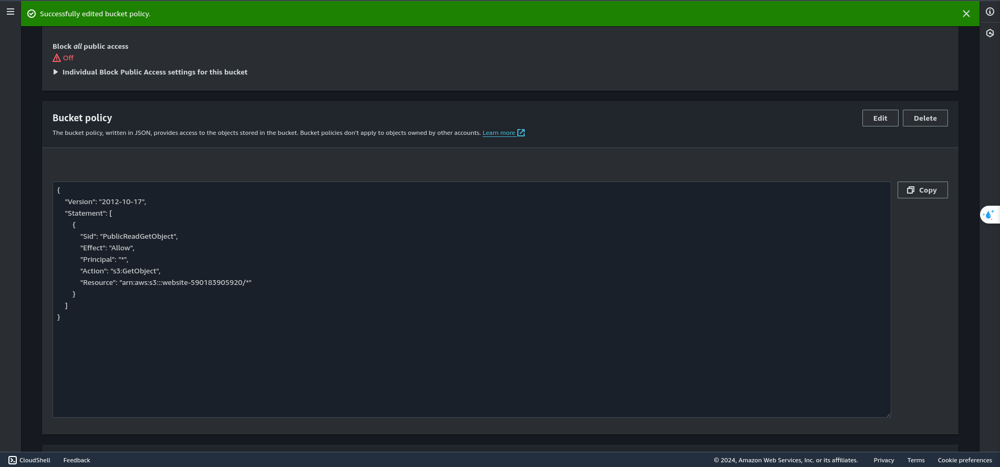
    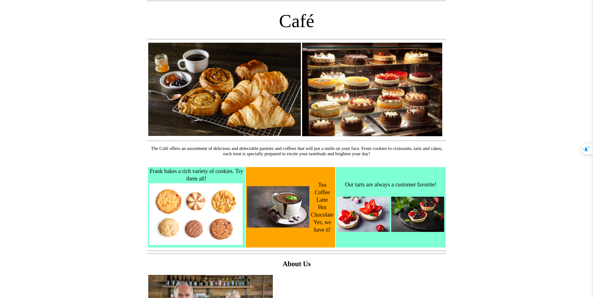
</div>

> **Protecting website data**
- Enabling versioning on the S3 bucket


### **Optimizing costs of S3 object storage**

> **Setting lifecycle policies**
- Configure two rules in the website bucket's lifecycle configuration, create two separate rules:
    - In one rule, move previous versions of all source bucket objects to S3 Standard-IA after 30 days
    - The other rule, delete previous versions of the objects after 365 days

<div style="display: flex; width: 50%;">
    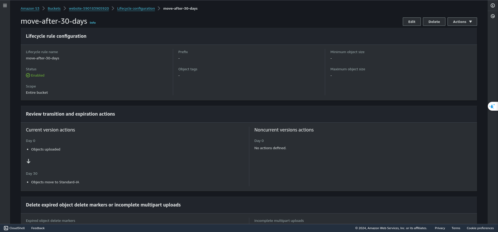
    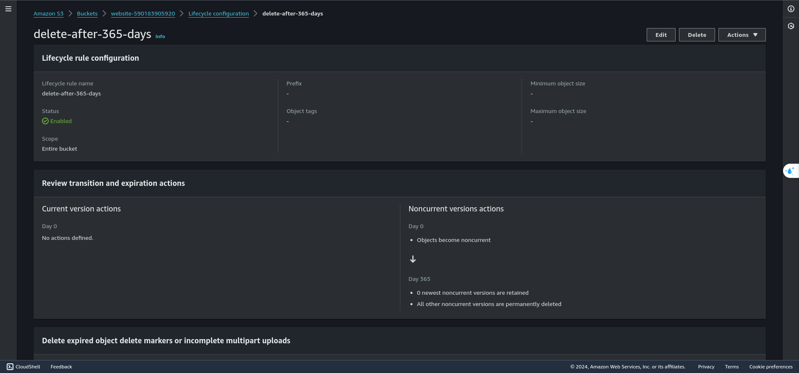
</div>

### **Enhancing durability and planning for DR**

> **Enabling cross-Region replication**
- In a different Region than the source bucket, create a second bucket and enable versioning on it. The second bucket will be the *destination bucket*.
- It was used the **CafeRole** for the AWS Identity and Access Management (IAM) role. This IAM role gives Amazon S3 permission to read objects from the source bucket and replicate them to the destination bucket.

> Replication 


> CafeRole
```json
    {
    "Version": "2012-10-17",
    "Statement": [
        {
            "Action": [
                "s3:ListBucket",
                "s3:ReplicateObject",
                "s3:ReplicateDelete",
                "s3:ReplicateTags",
                "s3:Get*"
            ],
            "Resource": [
                "*"
            ],
            "Effect": "Allow"
        }
    ]
}
```
---
# Adding a Compute Layer
## Creating a Dynamic Website for the Café
### Scenario
After the café launched the first version of their website, customers told the café staff how nice the website looked. However, in addition to the praise, customers often asked whether they could place online orders.

Sofía, Nikhil, Frank, and Martha discussed the situation. They agreed that their business strategy and decisions should focus on delighting their customers and providing them with the best possible café experience.

> At the end of this lab, the architecture should look like the following example


### Preparing an EC2 instance to host a website
The café wants to introduce online ordering for customers and enable café staff to view submitted orders. Their current website architecture, where the website is hosted on Amazon S3, does not support the new business requirements.

_**Note: In the first part of this lab, it will be configured an Amazon EC2 instance so that it is ready to host a website for the café. For a while, we've already had some resources created at the start of the AWS lab.**_


### Connecting to the IDE on the EC2 instance
By using the AWS Cloud9 environment, there's no need to download a key pair and connect to the EC2 instance by using SSH.

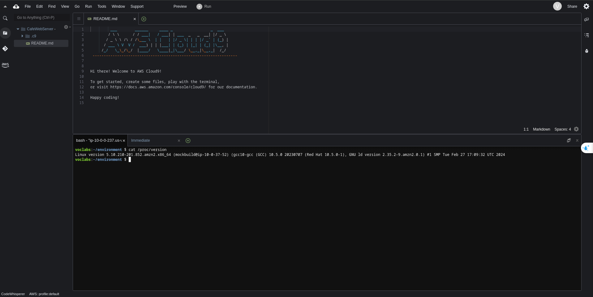

- Observe the web server, database, and PHP details and server state.


```sh
sudo yum update -y 
sudo yum install -y mariadb-server
sudo systemctl enable mariadb

sudo httpd -v
service httpd status

mariadb --version
service mariadb status

php --version
```
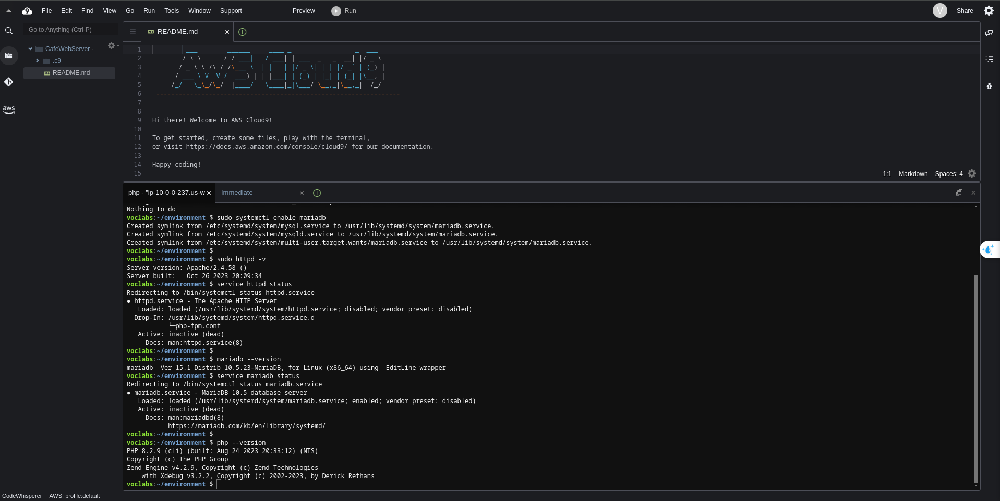

_Note: The output should show the versions of the web server and the database, and also show that they are not currently running_
<br>

- So, to start the web server and the database, we'll use these command on terminal

```sh
sudo chkconfig httpd on
sudo service httpd start
sudo service httpd status

sudo chkconfig mariadb on
sudo service mariadb start
sudo service mariadb status
```
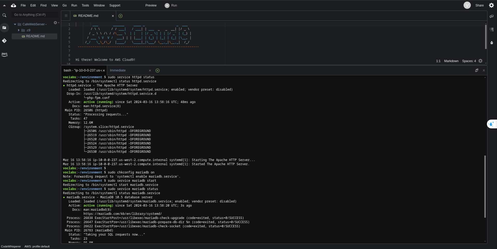
<br>

- Configure the EC2 instance so that we can use the AWS Cloud9 editor to edit web server files.
``` sh
ln -s /var/www/ /home/ec2-user/environment
sudo chown ec2-user:ec2-user /var/www/html
```

### Installing a dynamic website application on the EC2 instance
We have the basic setup for hosting a dynamic website for the café by installing the café application and database on the EC2 instance.

- Installing the café application, which creates the cafe, db, and setup directories in the work environment

```sh
cd ~/environment
wget https://aws-tc-largeobjects.s3.us-west-2.amazonaws.com/CUR-TF-100-PRYODA-1-37918/21-mod4-challenge-EC2/s3/mod4-challenge/setup.tar.gz
tar -zxvf setup.tar.gz
wget https://aws-tc-largeobjects.s3.us-west-2.amazonaws.com/CUR-TF-100-PRYODA-1-37918/21-mod4-challenge-EC2/s3/mod4-challenge/db.tar.gz
tar -zxvf db.tar.gz
wget https://aws-tc-largeobjects.s3.us-west-2.amazonaws.com/CUR-TF-100-PRYODA-1-37918/21-mod4-challenge-EC2/s3/mod4-challenge/cafe.tar.gz
tar -zxvf cafe.tar.gz
```
_Note: we can put "sudo" before the command in case some **denied access** error appears. In any case, these files will be present in the lab directory as well_

- Copy the café files over to the web server document root
```sh
mv cafe /var/www/html/
```

- Configure the application parameters to use the AWS Systems Manager Parameter Store
```sh
cd setup
./set-app-parameters.sh
```

- Configure the MySQL database to support the café application
```sh
cd ../db/
./set-root-password.sh
./create-db.sh
```

- to connect the terminal-based MySQL client to the database and accessing it.

```sh
mysql -u root -p
```
<br>

> In case of 'ERROR 1698 (28000): Access denied for user 'root'@'localhost'' after placing the password

- Try on it:
---
```sh
sudo mysql -u root -p
```

```sh
ALTER USER 'root'@'localhost' IDENTIFIED BY 'Re:Start!9';
FLUSH PRIVILEGES;
```
---
<br>

```sh
show databases;
use cafe_db;
show tables;
select * from product;
exit;
```

- Update the timezone configuration in PHP.
```sh
sudo sed -i "2i date.timezone = \"America/New_York\" " /etc/php.ini
sudo service httpd restart
```

### Testing the web application
```url
http://<public-ip>/cafe
```

<div style="display: flex; align-items: center;">
    <div style="margin: .1rem; text-align: center;">
        <h4>App working</h4>
        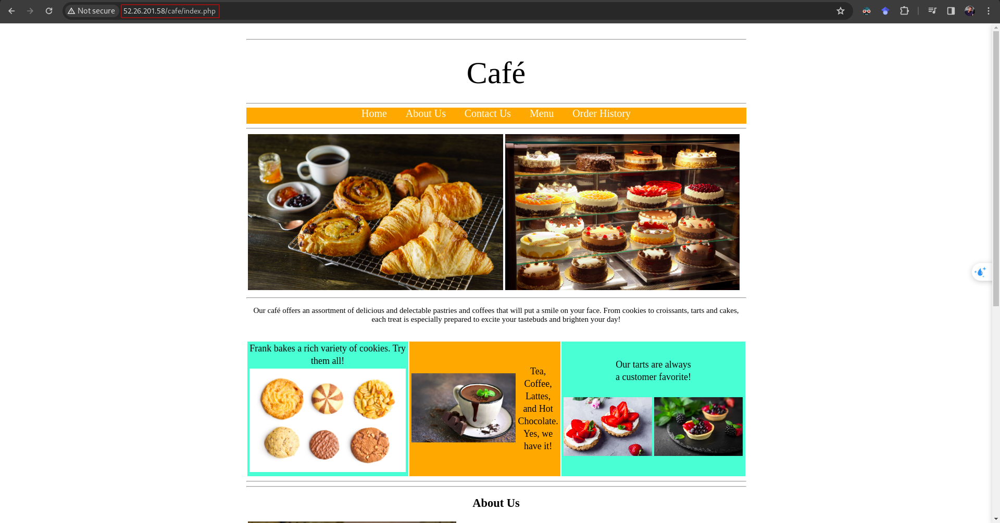
    </div>
    <div style="margin: .1rem; text-align: center;">
        <h4>Ordeing</h4>
        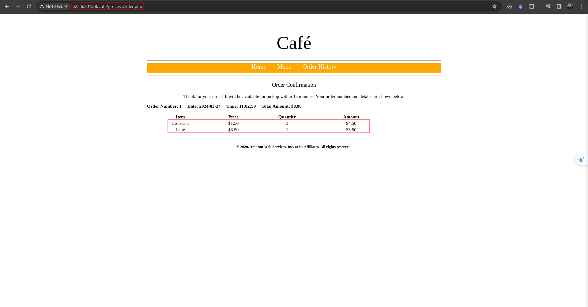
    </div>
</div>

---
# Adding a Database Layer
## Migrating a Database to Amazon RDS
### Scenario
The café currently uses a single EC2 instance to host their web server, database, and application code.

Meanwhile, café business has grown. The order history that's stored in the database provides valuable business information that the café staff doesn't want to lose. Martha uses the data for accounting, and Frank looks at it occasionally to plan how many of each dessert type he should bake.

Sofía has additional concerns. The database must be consistently upgraded and patched, and she doesn’t always have time to do these tasks. Also, administering the database is a specialized skill. Training others to do database administration isn’t something that she wants to spend time on. Meanwhile, Sofía is also concerned that the café isn’t doing data backups as often as they should.

Finally, Martha also wants to reduce labor costs that are associated with the technical learning investment that's needed to manage the database.

<div style="display: flex;">
    <div style="margin: .3rem; text-align: center;">
        <h4>Archtecture at the start of the lab</h4>
        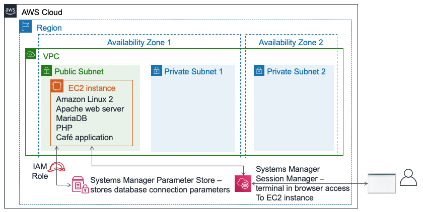
    </div>
    <div style="margin: .3rem; text-align: center;">
        <h4>Archtecture at the end of the lab</h4>
        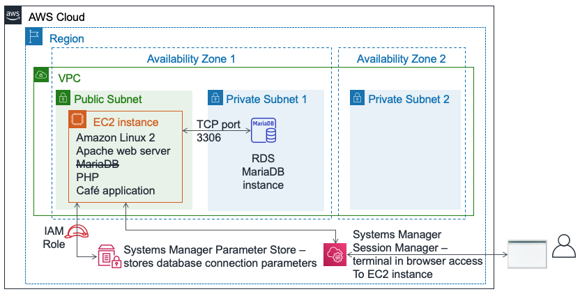
    </div>
</div>

_**Note: We've already created the architecture of the first image, now we have to migrate it to use RDS instead of using it in an EC2** instance**_

### Creating an RDS instance for the café application
We have to choose an architecture where the database should provide essential features such as durability, scalability, and high performance.

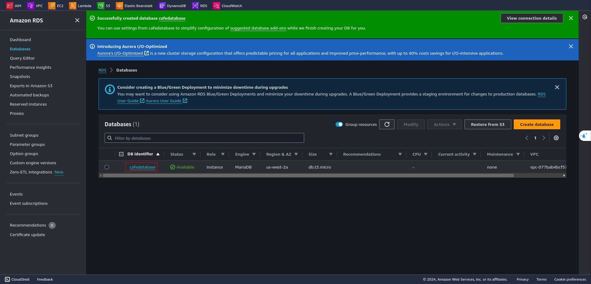

### Exporting data from the old database and establishing a connection to the new database
With the new RDS instance created, we can move on to the next step in the café's database migration plan by exporting the data from the database that the café application currently uses to the RDS database.

>  Connection to EC2 instance and capture existing data in a file by using the mysqldump utility.

```sh
mysqldump --databases cafe_db -u root -p > CafeDbDump.sql
```
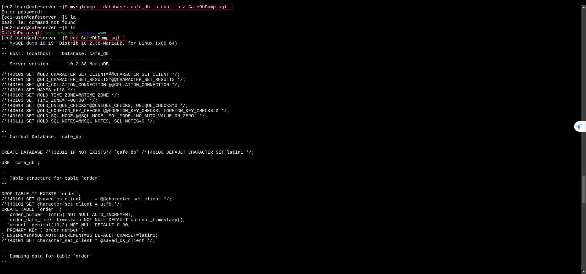

### Working with the RDS database

```sh
mysql -u admin -p --host <rds-endpoint>
```
<div style="display: flex; align-items: center;">
    <div style="margin: .1rem; text-align: center;">
        <h4>RDS Security Group</h4>
        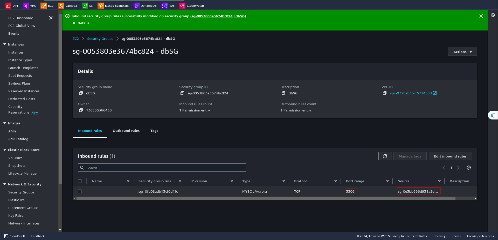
    </div>
    <div style="margin: .1rem; text-align: center;">
        <h4>RDS Database</h4>
        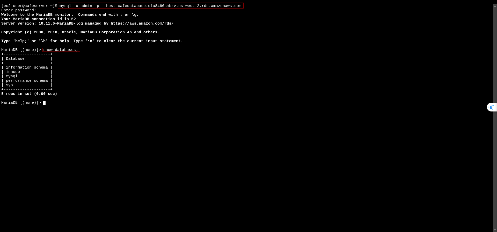
    </div>
</div>

### Importing the data into the RDS database instance
```sh
mysql -u admin -p --host <rds-endpoint> < CafeDbDump.sql
```
_Ex: "mysql -u admin -p --host **cafedatabase.c1u8466smbzv.us-west-2.rds.amazonaws.com** < CafeDbDump.sql"_

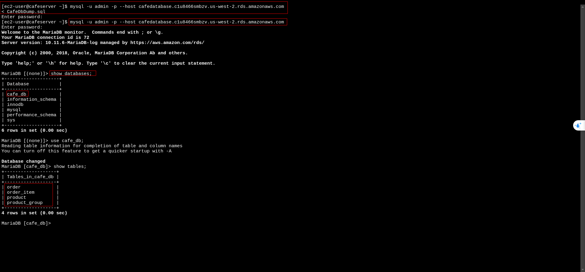

### Connecting the café application to the new database
Because the database connection information has changed, it will be necessary to update some values to connect the application to the new RDS database instance instead of to the database running on the EC2 instance.

- We must update the value field at the parameter store for **"dbUrl"**,**"dbPassword"** and **"dbUser"**
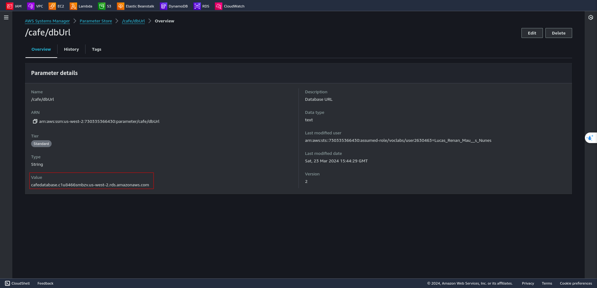


<div style="display: flex;">
    <div style="width: 50%;">
        <h4 style="text-align: center;">Parameter Store from AWS Systems Manager</h4>
        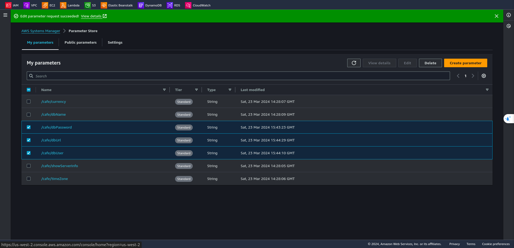
    </div>
    <div style="width: 50%;">
        <h4 style="text-align: center;">RDS Credentials</h4>
        <ul>
            <li><span style="font-weight: 700; text-transform: uppercase">RDS Endpoint:</span> cafedatabase.c1u8466smbzv.us-west-2.rds.amazonaws.com</li>
            <li><span style="font-weight: 700; text-transform: uppercase">RDS Password:</span> some@password</li>
            <li><span style="font-weight: 700; text-transform: uppercase">RDS User:</span> admin</li>
        </ul>
    </div>
</div>

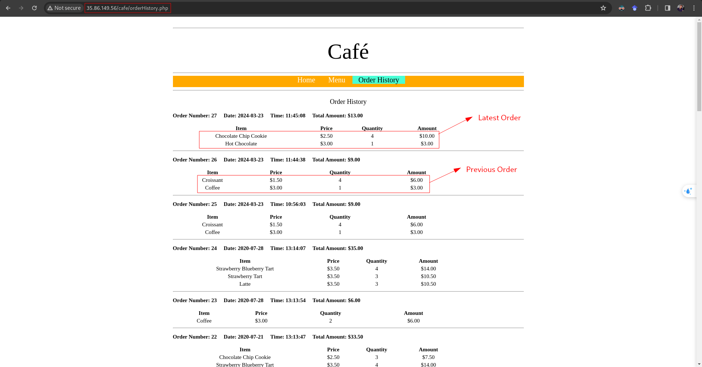
---
